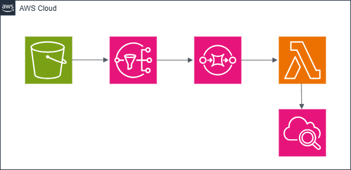

# AWS Project – Event-Driven Architecture

This project demonstrates an **event-driven architecture** on AWS, showcasing how events can be used to **decouple components** of an application.  
The flow starts from an **S3 object upload**, which triggers **SNS** and **SQS**, and finally invokes a **Lambda function** to process the event.

## Architecture Overview
**Sample Use Case:**
1. **Event Producer** – An **AWS S3 bucket** acts as the event source. Uploading an object generates an event.  
2. **Event Ingestion** – The event is published to an **SNS topic**.  
3. **Event Stream** – The SNS topic is subscribed to an **SQS queue**, which buffers and delivers messages reliably.  
4. **Event Consumer** – An **AWS Lambda** function consumes messages from the SQS queue and outputs the logs to **AWS CLoudWatch**.

This event flow decouples producers and consumers, improving scalability and fault tolerance.

---

## Architecture Diagram

---

## Components and Policies

This repository contains the configuration and IAM policies used in this implementation:

- **SNS Access Policy** – Grants permission for S3 to publish messages to the SNS topic.  
- **SQS Access Policy** – Allows SNS to send messages to the SQS queue.  
- **SNS Subscription Filter Policy** – Defines rules for which messages are forwarded to SQS.  
- **IAM Policy for Lambda** – Grants Lambda permissions to read messages from SQS and perform downstream actions (e.g., logging).

---

## Event Flow Description

1. **Object Upload:**  
   A new object is uploaded to the S3 bucket.

2. **Event Notification:**  
   The S3 bucket publishes an event to the SNS topic.

3. **Message Propagation:**  
   The SNS topic delivers the message to all subscribed endpoints — in this case, an SQS queue.

4. **Message Consumption:**  
   The SQS queue triggers the Lambda function asynchronously.  
   Lambda retrieves and processes the message (for example, logging metadata or transforming data).

---

## Cost
All services used in this project — S3, SNS, SQS, and Lambda — are part of the [AWS Free Tier](https://aws.amazon.com/free/).

---

## Files Included

| File | Description |
|------|--------------|
| `sns-access-policy.json` | Grants S3 permission to publish to SNS |
| `sqs-access-policy.json` | Grants SNS permission to send messages to SQS |
| `sns-filter-policy.json` | Filters messages sent from SNS to SQS |
| `lambda-iam-policy.json` | Defines Lambda’s execution role and permissions |

---

## How to Deploy

1. **Create the S3 bucket** and enable event notifications to publish to your SNS topic.  
2. **Create an SNS topic** and configure the appropriate access and filter policies.  
3. **Create an SQS queue** and subscribe it to the SNS topic.  
4. **Create a Lambda function** that polls the SQS queue and processes messages.  
5. **Test the setup** by uploading a file to the S3 bucket and confirming that Lambda is triggered.

---

## Cleanup

To avoid incurring costs:
- Delete the S3 bucket and all objects.
- Delete the SNS topic and SQS queue.
- Remove the Lambda function and IAM roles.
